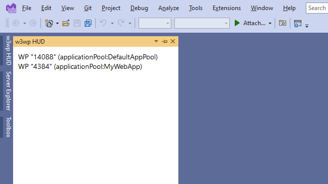

# w3wp HUD
A Visual Studio 2017 extension that provides a heads-up display of running w3wp.exe processes. Helpful for determining which w3wp.exe process to connect the debugger to when you have more than one running.



It is essentially a wrapper around running the following command:
```
c:\windows\system32\inetsrv\appcmd list wp
```
### Installation

You can find w3wp HUD in the [Visual Studio Gallery](https://visualstudiogallery.msdn.microsoft.com/f6b20277-984e-4c4b-a3ac-f1713f2437cd).

Alternatively, you can clone and build it yourself. You will need to install the Visual Studio 2017 SDK in order to do so. 

1. Clone this repository.
2. Build w3wpHUD.sln.
2. Run the generated w3wpHUD.vsix to install the extension (located in "bin/" directory).

### Usage Instructions

Find w3wp HUD in the "View > Other Windows" menu in Visual Studio. Dock the tool window to the location of your preference. Use the right-click context menu to refresh the display.

### Notes:
* Visual Studio must be running in adminstrator mode in order to use this extension.
* Visual Studio 2015 is also supported.
